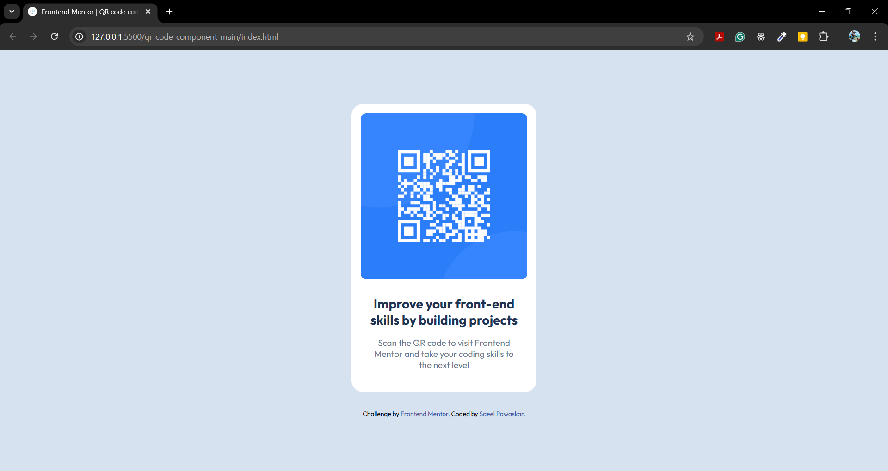

# Frontend Mentor - QR code component solution

This is a solution to the [QR code component challenge on Frontend Mentor](https://www.frontendmentor.io/challenges/qr-code-component-iux_sIO_H). The challenge helps improve HTML and CSS skills by creating a simple, card-style component with a QR code, a title, and descriptive text.

## Table of contents

- [Overview](#overview)
  - [Screenshot](#screenshot)
  - [Links](#links)
- [My process](#my-process)
  - [Built with](#built-with)
  - [What I learned](#what-i-learned)
  - [Continued development](#continued-development)
  - [Useful resources](#useful-resources)
- [Author](#author)
- [Acknowledgments](#acknowledgments)

## Overview

### Screenshot

### Link

- Solution URL: [QR Code Component Repository](https://github.com/saeel-pawaskar/qr-code-component.git)

## My process

### Built with

- Semantic HTML5 markup
- CSS custom properties
- Flexbox
- Google Fonts

### What I learned

During this project, I practiced using Flexbox to center and align elements and reinforced how to set up responsive layouts. I also learned how to use CSS custom properties for better color management.

### Continued development

In future projects, I plan to continue working on responsive design, focusing on using CSS Grid and Flexbox in combination for more complex layouts. Additionally, I want to explore more advanced CSS features like animations and transitions.
